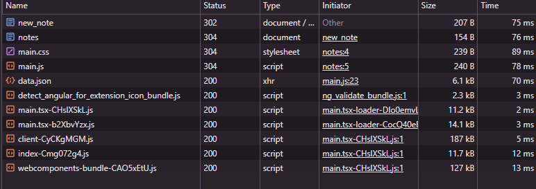
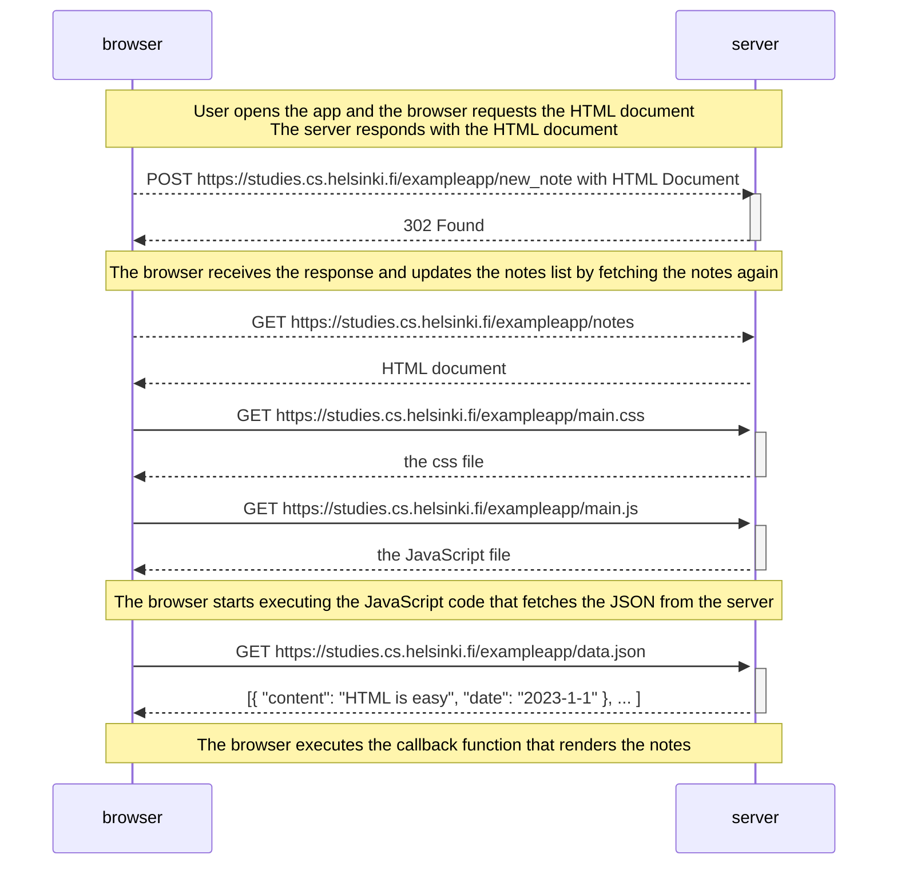

# Activity 4: Flowchart of the Code

```
This is the content of the console while executing the code.
The output is the flow diagram of the code itself.
```



## Activity 4: Resolution


```mermaid
sequenceDiagram
    participant browser
    participant server


    Note over browser,server: User opens the app and the browser requests the HTML document<br>The server responds with the HTML document
    browser-->>server: POST https://studies.cs.helsinki.fi/exampleapp/new_note with HTML Document
    activate server
    server-->>browser: 302 Found
    deactivate server
    Note over browser,server: The browser receives the response and updates the notes list by fetching the notes again
    browser-->>server: GET https://studies.cs.helsinki.fi/exampleapp/notes
    activate server
    server-->>browser: HTML document

    browser->>server: GET https://studies.cs.helsinki.fi/exampleapp/main.css
    activate server
    server-->>browser: the css file
    deactivate server

    browser->>server: GET https://studies.cs.helsinki.fi/exampleapp/main.js
    activate server
    server-->>browser: the JavaScript file
    deactivate server

    Note over browser,server: The browser starts executing the JavaScript code that fetches the JSON from the server

    browser->>server: GET https://studies.cs.helsinki.fi/exampleapp/data.json
    activate server
    server-->>browser: [{ "content": "HTML is easy", "date": "2023-1-1" }, ... ]
    deactivate server

    Note over browser,server: The browser executes the callback function that renders the notes

```
