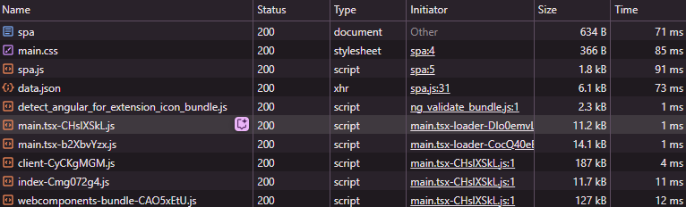
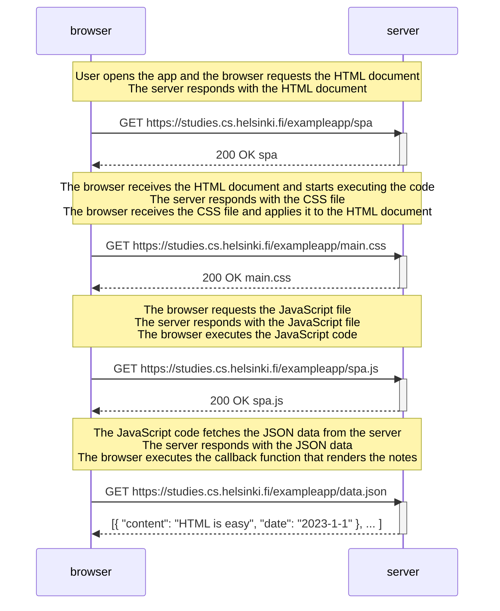

# Activity 5: Flow Chart of SPA Code

```mermaid
sequenceDiagram
    participant browser
    participant server

    Note over browser,server: User opens the app and the browser requests the HTML document<br>The server responds with the HTML document

    browser->>server: GET https://studies.cs.helsinki.fi/exampleapp/spa
    activate server
    server-->>browser: 200 OK spa
    deactivate server

    Note over browser,server: The browser receives the HTML document and starts executing the code<br>The server responds with the CSS file<br>The browser receives the CSS file and applies it to the HTML document

    browser->>server: GET https://studies.cs.helsinki.fi/exampleapp/main.css
    activate server
    server-->>browser: 200 OK main.css
    deactivate server

    Note over browser,server: The browser requests the JavaScript file<br>The server responds with the JavaScript file<br>The browser executes the JavaScript code

    browser->>server: GET https://studies.cs.helsinki.fi/exampleapp/spa.js
    activate server
    server-->>browser: 200 OK spa.js
    deactivate server

    Note over browser,server: The JavaScript code fetches the JSON data from the server<br>The server responds with the JSON data<br>The browser executes the callback function that renders the notes

    browser->>server: GET https://studies.cs.helsinki.fi/exampleapp/data.json
    activate server
    server-->>browser: [{ "content": "HTML is easy", "date": "2023-1-1" }, ... ]
    deactivate server
```
