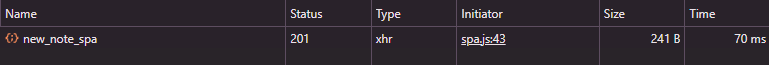
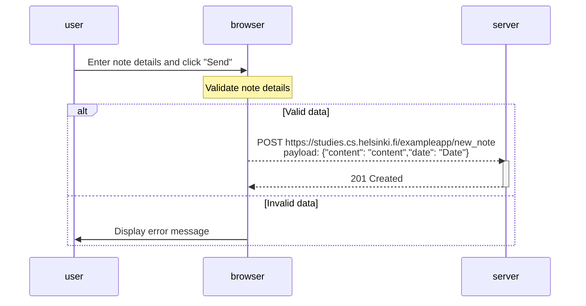

# Activity 6: Create a new note with a POST request

This is the content of the console while executing the code.

```mermaid
sequenceDiagram
    participant user
    participant browser
    participant server

    user->>browser: Enter note details and click "Send"
    Note over browser, browser: Validate note details

    alt Valid data
        browser-->>server: POST https://studies.cs.helsinki.fi/exampleapp/new_note <br>payload: {"content": "content","date": "Date"}
        activate server
        server-->>browser: 201 Created
        deactivate server


    else Invalid data
        browser->>user: Display error message
    end

```
